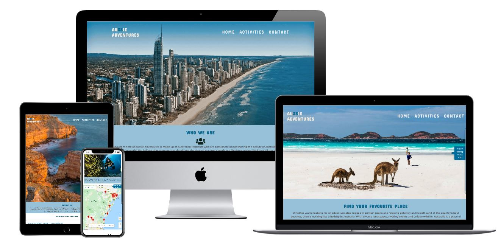
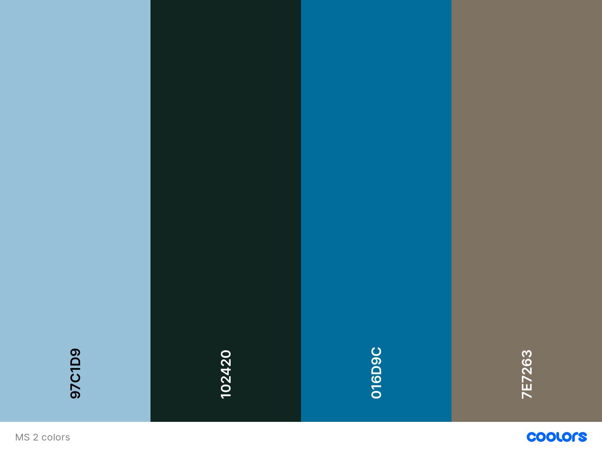
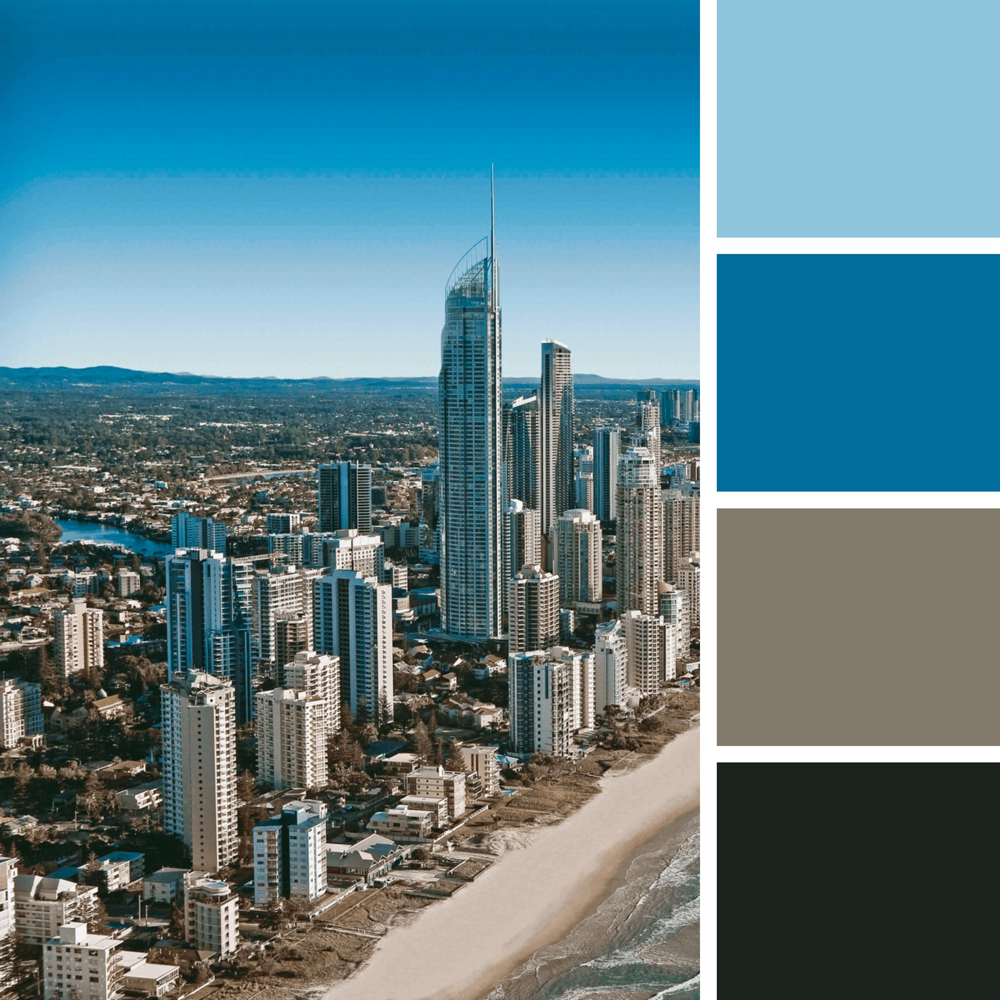

# Milestone 2 -Interactive Front-End 
# Aussie Adventures

This project is an interactive front end website, built from my learnings of all the Code Institute Full Stack Developer Course modules learnt so far, including HTML, CSS and JavaScript.
Aussie Adventures is an application that uses Google Maps API to allow users to search for different types of activities and places (Parks, Diving, Surfing, Restaurants, Camping or Beaches) for their next holiday in Australia. The users can find things to do by clicking on the categories of activities or places. The application also allows the users to get detailed information (name, address, contact number, rating, website name and price level) of the chosen activity by clicking at the marker. 
The application has a pull-out taking-notes app for the user to save the places or things to do chosen from the map. 
Also, the website gives the users overall information about Australia and provides a gallery of images from Australia.

[Click here to view the project live](https://luizagit.github.io/Aussie-adventures-MS2)

# Table of contents:

- [Milestone 2 -Interactive Front-End](#milestone-2--interactive-front-end)
- [Aussie Adventures](#aussie-adventures)
- [Table of contents:](#table-of-contents)
    - [User Stories](#user-stories)
        - [New users:](#new-users)
    - [Strategy](#strategy)
      - [Scope plane:](#scope-plane)
      - [Structure plane](#structure-plane)
      - [Skeleton](#skeleton)
      - [Surface](#surface)
  - [Features](#features)
    - [Existing features](#existing-features)
    - [Features Left to Implement](#features-left-to-implement)
  - [Technologies Used](#technologies-used)
    - [Additional tools used](#additional-tools-used)
  - [Testing](#testing)
    - [General Testing](#general-testing)
    - [Validators](#validators)
      - [Testing on Different Browsers](#testing-on-different-browsers)
      - [Testing on Different Devices](#testing-on-different-devices)
  - [Deployment](#deployment)
  - [Credits](#credits)
    - [Content](#content)
    - [Disclaimer](#disclaimer)
    - [Acknowledgements](#acknowledgements)

### User Stories
This section provides insight into the UX process, focusing on who this website is for, what it is that they want to achieve and how this project is the best way to help them achieve these things.

##### New users:

* As a traveller, I want to find information about different types of activities and places and show them locations on a map for my next holiday in Australia.
* As a traveller,I want to have more targeted activity options to choose from.
* As a traveller, I want to find general information about travelling in Australia, so I can prepare everything before travel.
*  As a traveller, who is either a visitor in Australia or thinking of visiting Australia I want to know the best local spots from residents, so I can choose the best places to visit.
* As a traveller, I want to check out different places/activities that are nearby in the city where I travel, so I can choose one to go .
* As a traveller , it would be useful to be able to write a list of places of interest I would like to go. 
* * As a busy person, who spends almost all the time working, I have no time for planning my holidays, so I want to contact the Aussie Adventures team directly to get neccesary information for my next holiday according to my personal preferences.
* As a busy person who I have no time to read about safe places to go, so I want to contact the Aussie Adventures team directly to get neccesary information to make my holiday in Australia safe.

### Strategy 
My goal in design was to make it simple to access information on the site, as well as to give the users the feeling of reliability, security and positiveness.
Also, to give travellers a useful set of information and gives some recommended things to see or do in Australia.

#### Scope plane:
* The website is made for helping travellers to plan their holidays using the map.
* The map was centered the map on the user's location to find the nearby places.
* he website is made for helping travellers to create a list of chosen places to see or do or a list of details of each chosen place.

#### Structure plane
* The project consists of 3 different pages "Home", "Activities",and "Contact" which can be accessed clicking on the nav links. All features are responsive on all device sizes.

1.Home page:
+ info about Aussie Adventures team
+ reasons to travel in Australia
+ general info about Australia
+ gallery of australian places
  
1.Activities page:
+ cards with activities and places options
+ an interactive google map
+ a pull-out taking-notes app to save the details of places to visit or activities to do which can be placed into a list .

4.Contact page:
+ Faq section
+ contact details - the contact details 
+ contact - form with submit form allows users to contact the team, by having them fill out the contact form (the modal opens and gives a feedback to users and the message sends via SendEmail Js
+

#### Skeleton

 Balsamiq Wireframes was used to create all wireframes for the project.
 wireframes with some comments for desktop, tablet, and mobile devices can be found below:

 - Desktop version [Here](design/aussie-adventures-wireframes-desktop.png)
 - Tablet version [Here](design/aussie-adventures-wireframes-tablet.png)
 - Mobile version [Here](design/aussie-adventures-wireframes-mobile.png)

 Wireframes - final version (changes on contact form) with some comments for desktop, tablet and mobile devices can be found below:
 - Desktop version [Here](MS2-wireframes-DESKTOP-version-final.pdf)
 - Tablet version [Here](MS2-wireframes-mobile-version-final.pdf)
 - Mobile version [Here](MS2-wireframes-tabletversion-final.pdf)
 
#### Surface
As a starting point I used the image chosen for my landing page which helped to choose the color pallete for the entire website.
Below is a picture of the color palette I got off the website Coolors [https://coolors.co/]

I used different shades for some containers. I also used different opacities of the same colour to create a layering effect and give the design hierarchy.

**Typography**
* I used Google Fonts to select the fonts for my project. 
* Concerto One, cursive is used throughout the whole website for headings to give a modern look to the website and Montserrat for body font.

 **Imagery**

I used impressive and interesting use of imagery in the hero images for each page.Imagery used for intuitive explanation of information and showing inviting scenery.

## Features

### Existing features 
+  The project consists of 3 different pages "Home", "Activities",and "Contact" which can be accessed clicking on the nav links. All features are responsive on all device sizes.
+  The navigation links are on top of the page. The menu items are easy to understand. 
+ The brand name "Aussie Adventures" appears on every page. Acts as a navigation link back to the user's home page.
+ Each page features responsive navigation with the conventional placing of the brand name on the top left for large screens and top center for phones and ipad.
+ Each section details relevant information required to convince users to choose Australia for next holiday. The full navigation menu shrinks down to a small menu with a hamburger menu on smaller devices - phones and ipad. The navigation links and brand name slide on the screen when the user clicks on hamburger menu and hamburger closes in X.
+ In the "Home" page the user receives some details about thhe Aussie Adventures team, general info about Australia and some reasons to visit this country.
+ The "Activities" link will take the user to a google map above of it he can make interactive selections.The users can find camping, beaches, restaurants, museums, surfing, parks and diving by clicking at the categories.
+ The application also allows the users to get detailed information (name, address, contact number, rating website name and price level) of the chosen establishment by clicking at the marker.The price level of the place (if it's defined) ,is on a scale of 0 to 4. Price levels are interpreted as follows:
  
 * 0: Free
 * 1: Inexpensive
 * 2: Moderate
 * 3: Expensive
 * 4: Very Expensive
  
+ The website gives the users general information  about Australia by clicking the "find out more" buttons on cards from Learn about Australia section.
+ The menu at the top of the page and footer are consistent in design and responsiveness.
+ The "Contact page" link leads to a FAQ section that gives the users general information of travelling in Australia by clicking on each question.
+ Every page contains a footer image of Sydney city outline skyline with the social icons.Fixed footer allows the user quick accessibility to social media links
+ The map will also show the Users current location once they allow it.
+ The website contains a pull-out taking-notes app for the user to save the places or things to do chosen from the map. 
+ Scroll to top button on each page
+ Gallery with a filter on categories of images.
+ The contact form includes four input fields name, email address, message input field. Using the emailJS SDK the user can send the message by clicking the “send message” button at the bottom of the form.
+ Animations icons with Css
+ Animated elements with Scroll reveal

### Features Left to Implement
* The website application could have many features added, especially with regard to Google Maps APIs.

## Technologies Used

* HTML5 - used for the structure the content of the website.
* CSS3 - used to style  most of the elements on the page such as: fonts, color, spacing, positioning, some of the responsiveness etc.
* Javascript
* Email JS SDK - The project uses the email JS SDK to allow users to contact the Aussie Adventures team.
* [Bootstrap](https://getbootstrap.com/)- used to help for the responsive grid layout, navbar, modals, carousel, and forms.
* [GitHub](https://github.com/) - used to create and host the repository
* [Git](https://git-scm.com/) for version control
* [Visual studio code](https://code.visualstudio.com/)- used as my IDE to develop the project
* [JQuery](https://jquery.com/)- usedto simplify DOM manipulation.
* https://scrollrevealjs.org/guide/installation.html
* Chrome DevTools used for responsiveness on different media sizes
* [GoogleFonts](https://fonts.google.com/)  - to import the font-family used in the website
* [FontAwesome](https://fontawesome.com/)- all Icons were taken from the Font Awesome database.

### Additional tools used
* [W3C Markup Validation Service](https://jigsaw.w3.org/css-validator/) - used to run all CSS code through and see if there are any errors in it
* [HTML Validator](https://validator.w3.org/)- used to run all HTML code through and see if there are any errors in it
* [Js Hint](https://jshint.com/) used to run all Js code through and see if there are any errors in it
* [Code Beautify CSS beautifier](https://www.freeformatter.com/css-beautifier.html) - used to make my CSS look nicer and tidier
* [Code Beautify HTML](https://webformatter.com/) - used to make my HTML tidier
* [Autoprefixer](https://autoprefixer.github) - used to add vendor prefixes to my CSS
* [Favicon Generator](https://realfavicongenerator.net/) - used to make the favicons
* [Tinypng](tinypng.com )- used to compress my image files to try to reduce the loading time for each page
* [Editor markownn language text](https://dillinger.io) - used to write ReadMe
* [Icons 8](https://icons8.com/) - used for favicon icon
* [Techsini](https://techsini.com/)- used for mockup

## Testing

### General Testing
* Tested the navigation on different types of screens
* Tested all external links opened in a new tab and went to the correct page
* Tested all internal links within the pages
* Tested the logo linked back to the home page on all pages
* Tested all buttons work
* Tested the filter works on the gallery section
* Tested Google Map to open markers
* Tested the markers on map opened by click and opened a infowindow with the following details: name, address, contact number, rating, website name and price level.
* Tested to open the taking-notes app tab .
* Tested to fill the input field and press 'Enter' or press the 'Add note' button in the taking-notes app.  Also, tested with no content in the input field, and it should warn with a message. Tested to add a number of notes, delete using the X or click 'Delete Notes' to delete  the whole list. 
* Tested to submit the contact form and verify that a modal form appears and the message received via e-mailJS.
* Tested the Website ran correctly when user clicked on the scroll to top button

### Validators
* W3C HTML -I validated the HTML with the W3 Validation Service and I found a couple of stray closing tags
* W3C CSS Validator - no errors were found.
The responsiveness of this website was tested constantly during the development process. It was tested in real desktops, tablets and mobile devices as well as on Google Chrome developer tools.
* Javascript- I validated the Javascript code in JSHint and most warnings were about let and const only available in ES6 and there were some undefined variable but these  are all called from the html files.

#### Testing on Different Browsers
I manually tested the website and worked fine as expected on the following browsers:
* Chrome
* Opera
* Mozilla Firefox
* Microsoft Edge

#### Testing on Different Devices
I sent the website link to my friends and family members, so the website was tested on the following devices:

* Iphone 5
* Samsumg S8
* Iphone 11
* Iphone 11 Pro,
* Huawei P20
* Galaxy J7
* Lg G6

This website has been tested through the [Techsini tool](https://techsini.com/) for the image used in the UX section showing the different screen sizes.Click [here](design/mockup-Aussie-Adventures.JPG) to see the screenshot of the results achieved.

## Deployment

* This project was created with Visual Studio Code.
* I deployed Aussie Adventures project GitHub pages using the following steps:
Logging into my GitHub account and locating my repository
Clicking on the Settings icon (near the top right of the page)
Scrolling down the page to locate the 'GitHub Pages' section
I selected 'Master branch' in the dropdown
This deployed my project to the URL: https://luizagit.github.io/Aussie-adventures-MS2/
[Click here to view the project live](https://luizagit.github.io/Aussie-adventures-MS2/)

## Credits
- [Code Institute](https://codeinstitute.net/)
 Significant part of the maps.js file JavaScript code has been taken from the  Google Maps Platform Documentation and  Google Places API documentation, then modified, customised and supplemented in accordance with the goals: 
 + https://developers.google.com/places/web-service/place-data-fields
 + https://developers.google.com/maps/documentation/javascript/infowindows
 + https://developers.google.com/places/web-service/place-data-fields
 + https://developers.google.com/maps/documentation/javascript/examples/infowindow-simple-max#maps_infowindow_simple_max-javascript
 + https://github.com/googlecodelabs/google-maps-nearby-search-js/
 + https://css-tricks.com
+ https://www.w3schools.com 
+ https://getbootstrap.com
+ https://stackoverflow.com/- was used for occasional debugging or issues where I could not initially work out the solution myself
+ https://css-tricks.com/auto-sizing-columns-css-grid-auto-fill-vs-auto-fit/
+ https://unpkg.com/scrollreveal -JS library reveals HTML elements as they enter or leave the viewport. 

### Content

 * The photos used in this site were obtained from https://unsplash.com/
 * I get some inspiration and find information for my most of the text content from the websites https://www.australia.com/, https://travelpicker.com/, https://www.lonelyplanet.com/
* The footer image was taken from https://pngtree.com/.
* The favicon icon was taken from https://icons8.com/.

 ### Disclaimer
This project is for educational purposes only.

### Acknowledgements

 - Code Institute for the course material and their inspiration from challenges and mini projects.
 - I would like to give a thank you to my mentor Seun Owonikoko.

